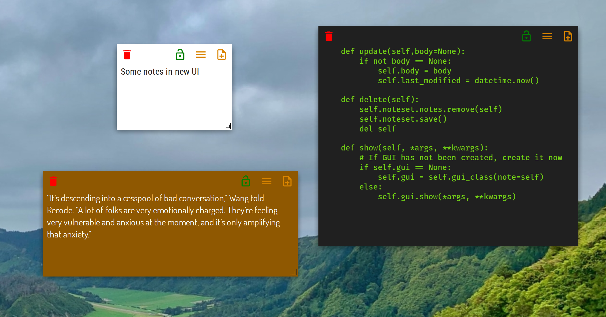

# indicator-stickynotes
Indicator Stickynotes: Sticky notes for your desktop

Forked: https://github.com/umangv/indicator-stickynotes

Add some tweaks:
- Scrollbar


Run
```bash
git clone https://github.com/phuoclhb/indicator-stickynotes.git indicator-stickynotes
cd indicator-stickynotes
/usr/bin/python3 ./indicator-stickynotes.py
```

Screenshot

